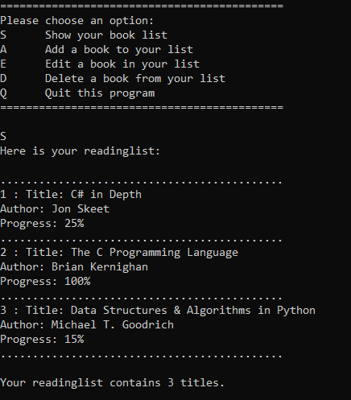

# readinglist

Console based reading list app.

Features:
- Add new books with an author, title, and progress percentage,
- Display the books in their reading list,
- Edit or delete entries
- User's reading list is stored in persistent storage for later use

Planned features:
- Option to sort the reading list by multiple values
- Exporting of reading list as a text file
- Different 'book shelves' for 'reading,' 'want to read,' and 'finished reading'
- Implement a basic UI through WPF
